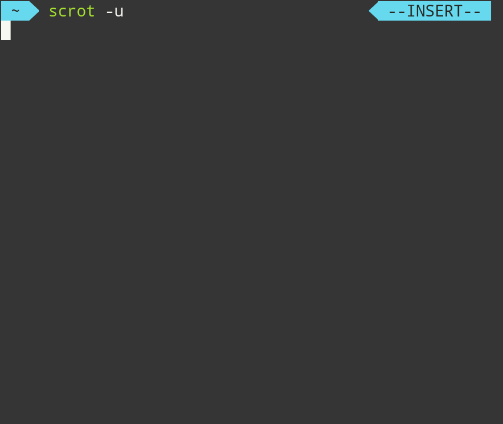
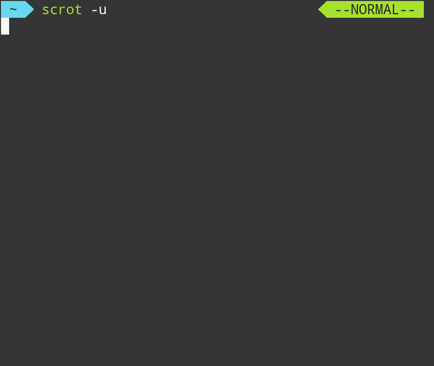

# coffeenostor-zsh-theme

## coffeenostor.zsh-theme
A theme file (should be placed in ~/.oh-my-zsh/themes).
This is practically identical to agnoster, but has a right-prompt for vi-mode.
The right-prompt that has --INSERT-- and --NORMAL--, while also complying with the powerline look

## Screenshots

